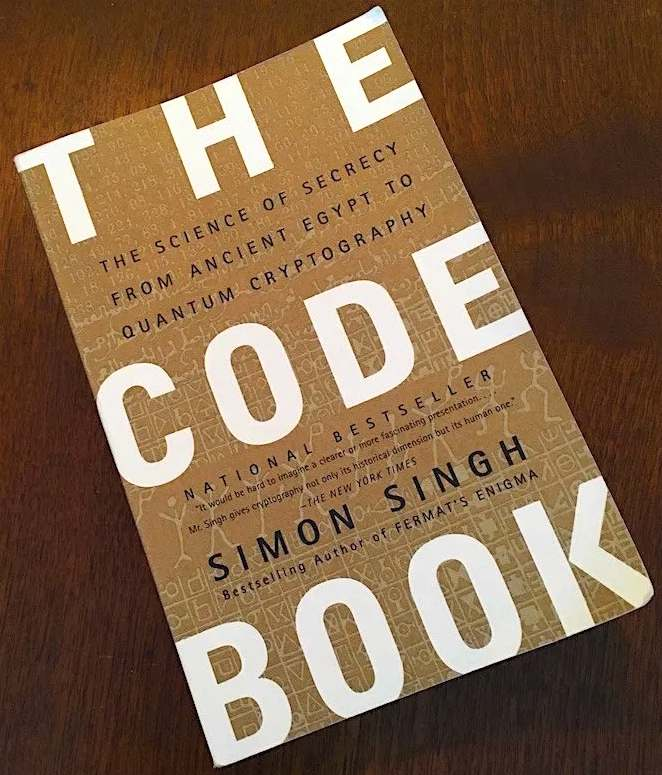
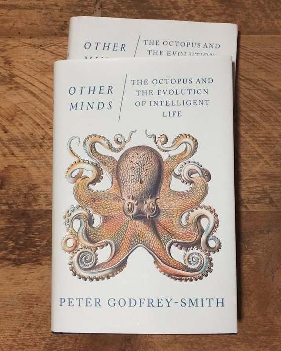
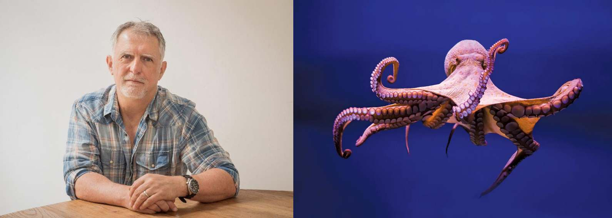
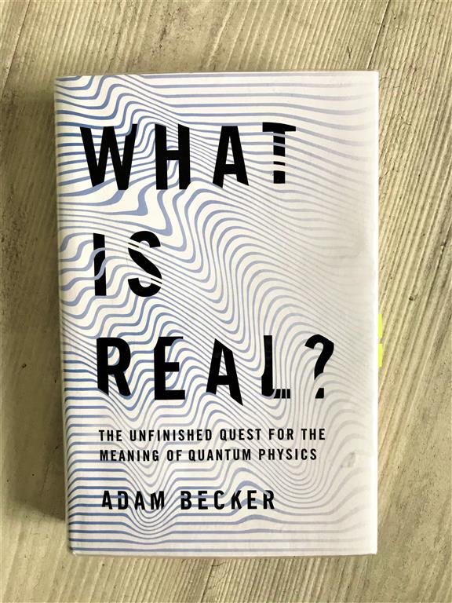

# \#1 The Code Book: The Science of Secrecy from Ancient Egypt to Quantum Cryptography

- Havia vários sistemas de cifragem mecânica (análogos, mas mais fortes, que a Enigma) que, embora seguras, eram muito lentas: as mensagens tinham que ser digitadas na máquina, a saída anotada e então transmitida pelo operador de rádio letra por letra. Na recepção, o operador passava a mensagem para o criptógrafo, que escolhia a chave correta e digitava a mensagem, letra por letra, na máquina que descriptografava. "“When the fighting became confined to a small area, everything had to move on a split-second schedule. There was not time for enciphering and deciphering."

- A solução, extremamente simples, foi encontrada por Philip Johnston, uma das únicas pessoas de fora que falava Navajo.

- [Resumo sobre o idioma Navajo] "The impenetrability of the Navajo code was all down to the fact that Navajo belongs to the Na-Dene family of languages, which has no link with any Asian or European language." + polissintética?

> Fully aware of how impenetrable the language was for those outside the tribe, Johnston was struck by the notion that Navajo, or any other Native American language, could act as a virtually unbreakable code. If each battalion in the Pacific employed a pair of Native Americans as radio operators, secure communication could be guaranteed.

- Ele levou a ideia pro Lieutenan Colonel James E. Jones, are signa officer at Camp Elliott, que foi convencido só de ouvir o Johnston falando algumas frases em Navajo.

- Colocaram em prática e funcionou:

> The code talkers soon proved their worth on the battlefield. During one episode on the island of Saipan, a battalion of marines took over positions previously held by Japanese soldiers, who had retreated. Suddenly a salvo exploded nearby. They were under friendly fire from fellow Americans who were unaware of their advance. The marines radioed back in English explaining their position, but the salvos continued because the attacking American troops suspected that the messages were from Japanese impersonators trying to fool them. It was only when a Navajo message was sent that the attackers saw their mistake and halted the assault. A Navajo message could never be faked, and could always be trusted.

- Much of recent cryptography history is linked to warfare. Gladly, a whole other lot of it is not. [deciphering linear b: tá logo depois dos Navajos no livro]

- Problemas valendo dinheiro que resolveram rapido

# \#2 [Other Minds: The Octopus, the Sea, and the Deep Origins of Consciousness](https://en.wikipedia.org/wiki/Other_Minds:_The_Octopus,_the_Sea,_and_the_Deep_Origins_of_Consciousness)

Nagel once popularized the question --- originally posed by Timothy Sprigge --- ["What is it like to be a bat?"](https://www.jstor.org/stable/pdf/2183914.pdf?casa_token=CzT9LCrZIPsAAAAA:jr9TcVVl_KBVoWo9SOEY0sJbVTcbOiT32umC20YZ_SVRbH9Q0xFqi6Nd1ZK-srJ9w_PalcC6CVvl1T-mffiTYQiPx_ILYc_bCISXCPhNzPEKQUnblJe6), from which he concluded that "fundamentally an organism has conscious mental states if and only if there is something that it is like to _be_ that organism --- something it is like _for_ the organism". In _Other Minds_, Peter Godfrey-Smith put me uncannily close to feeling octopuses do know what it is like to be themselves.

A philosopher of mind who disagrees with the notion that consciousness suddenly emerged from unthinking matter, Godfrey-Smith extends Nagel's definition by considering an evolutionary perspective in which consciousness gradually emerged. But "how can the fact of life feeling like something slowly creep  into being? How can an animal be halfway to having it feel like something to be that animal?" These are some questions he sets out to answer in an unexpected way: by observing octopuses.

The book starts out by describing life in the [Ediacaran Period](https://www.britannica.com/science/Ediacaran-Period) (~600 million years ago), of which there are the oldest evidence of bilaterians. These highly symmetrical forms of life further branched into several lineages with "complex active bodies" --- a supposedly necessary condition for consciousness --- during the Cambrian. On one of these ramifications are us, and on another are octopuses, squids, cuttlefish and further cephalopods. All of this is to say that we are _very_ different from octopuses --- which is arguably a not so surprising fact.

While this may sound quite boring, I can guarantee you it isn't. But it is nowhere close to be as interesting as what comes next. Apart from a philosopher, Godfrey-Smith is also a scuba diver who for many years dived in the coast of Australia, especially somewhere he calls "Octopolis". During the next one or two-hundred pages, he intersperses discussions on philosophy of mind with accounts of his many encounters with these animals, of which he says 

> Cephalopods are an island of mental complexity in the sea of invertebrate animals.  Because our  most recent common ancestor was so simple and lies so far back, cephalopods are an independent experiment in the evolution of large brains and complex behavior. If we can make contact with cephalopods as sentient  beings,  it is not because of a shared history, not because of kinship, but because evolution built minds twice over. This is probably the closest we will come to meeting an intelligent alien.

Among endless fascinating aspects of octopuses are the facts that --- being an invertebrate ---, it can squeeze through holes as small as their eyes, and their nervous system is highly descentralized: 2/3 of its neurons are spread between its arms, which are considerably independent, although they can also be controlled in a coordinated manner. Plus they can learn to turn lights off

> Octopuses in at least two aquariums have learned to turn off the lights by squirting jets of water at the bulbs when no one is watching, and short-circuiting the power supply. At the University of Otago in New Zealand, this became so expensive that the octopus had to be released back to the wild.

and they very clearly dislike *some* people, which means they can recognize us:

> In the same lab in New Zealand that had the “lights-out” problem, an  octopus took a dislike to one member of the staff, for no obvious  reason. Whenever that person passed by on the walkway behind the tank,  she received a half-gallon jet of water down the back of her neck.

Godfrey-Smith's many fascinating observations then serve as real-life examples to justify his claims that cephalopods, while immensely foreign and living in environment immensely different from ours, present uncannily rich behavior (of which you can [read here](https://www.scientificamerican.com/article/the-mind-of-an-octopus/) and [watch here](https://en.wikipedia.org/wiki/My_Octopus_Teacher)). As Daniel Dennett says in [his review of the book](https://ase.tufts.edu/cogstud/dennett/papers/review_of_PGS.pdf)

> That is part of what makes the decentralized, distributed computational architecture of the  cephalopods so fascinating: it turns out that there is more than one way of designing a nervous  system that can think ahead effectively.

While some readers may be bogged down by the more philosophical sections, this is all in all a very dynamic and interesting reading. Plus, it runs at only ~200 pages, so you won't get too angry if it ends up not being that much appealing to you as it was to me.

# \#3 What Is Real? The Unfinished Quest for the Meaning of Quantum Physics

